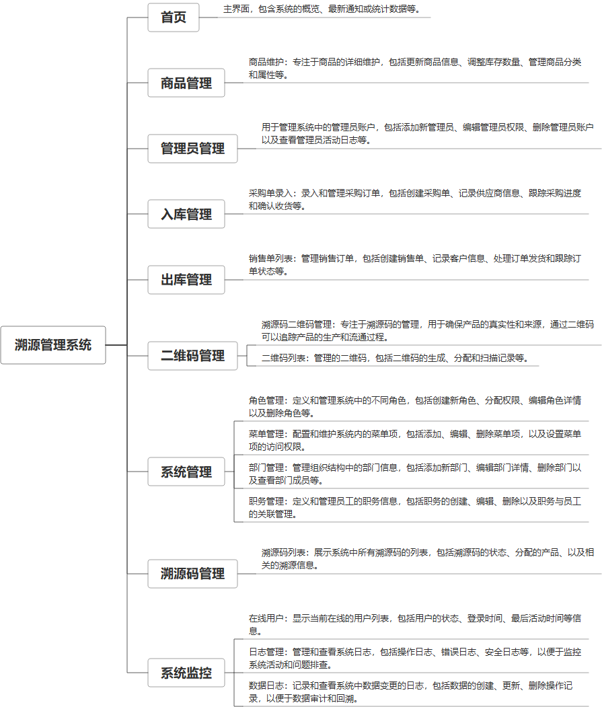

 

    
 

公司拥有上百套具有自主知识产权的软件系统，详情请查看码云首页或公司官网

 
<h1>溯源管理系统</h1>

<a href="https://www.haishi.net.cn/">公司官网</a> ｜ <a href="https://www.haishi.net.cn/">在线体验</a>

 

## 系统介绍

溯源管理系统通过商品管理、入库管理、出库管理、销售单管理、二维码和溯源码管理等多项功能，实现产品从生产到消费的全面可追溯性，结合管理员管理、报表设计、系统管理和系统监控，确保数据准确、安全。
溯源管理系统通过商品管理、入库管理、出库管理、销售单管理、二维码和溯源码管理等多项功能，实现产品从生产到消费的全面可追溯性，结合管理员管理、报表设计、系统管理和系统监控，确保数据准确、安全。
---
本项目名称为溯源管理系统，实现对商品从生产、入库、出库、销售等环节的全流程溯源管理。
本项目从用户层面可以分为一个端：
- 管理端：公司内部管理员用户使用，可以进行商品管理、入库管理、出库管理、溯源码管理、系统管理等。
---
                

## 系统功能介绍

### 系统包含终端说明

管理端（WEB）

| 序号 | 模块 | 模块说明 |
| --- | --- | --- |
| 1 | GC-SUYUAN-SCQY-SERVER | 服务端 |
| 2 | GC-SUYUAN-SCQY-MANAGE | 管理端 |

### 系统功能结构

### 系统功能说明

- 溯源码管理：对商品的溯源码进行管理，包括生成、查询、追溯等功能。
- 入库管理：对商品的入库进行管理，包括采购单录入、入库审核等功能。
- 出库管理：对商品的出库进行管理，包括销售单列表、出库审核等功能。

## 系统主要界面

## 系统技术说明

### 代码模块说明

| 序号 | 目录 | 目录说明 |
| --- | --- | --- |
| 1 | GC-SUYUAN-SCQY-SERVER/px-boot-base | -- |
| 2 | GC-SUYUAN-SCQY-SERVER/px-boot-module-system | -- |
| 3 | GC-SUYUAN-SCQY-SERVER/.idea | -- |

### 系统技术选型

#### 开发语言/框架

JAVA（JDK1.8）
前端框架：VUE2
框架：SpringBoot2.x
系统结构：单体应用

#### 服务中间件

Nginx
Tomcat

#### 数据库

MySQL（5.7+）
Redis

#### 其他说明

无

## 系统演示/商用

请扫码添加客服微信获取演示地址和系统详细资料。

如果您想基于溯源管理系统进行商业化交付或定制开发服务，我们提供有偿的技术服务支持，合作模式不限，欢迎沟通！

公司官网地址： <a href="https://www.haishi.net.cn/">https://www.haishi.net.cn</a>

联系客服获取专业回答。

## 使用须知

1、 本项目商用必须获得版权所有者的授权。

2、 未经允许本项目代码不允许二次出售。

